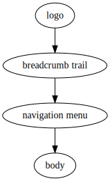

# Ruth Cookbook

See the [README](README.md) for installation and usage. The rest of this
document shows examples of its use.

## Generating a web site <a name="website-example"></a>

Suppose a web site has the following page design:



Most of the elements are the same on each page, but the breadcrumb trail has
to show the canonical path to each page, and the logo is bigger on the home
page, `index/index.xhtml`.

Suppose further that the web site has the following structure, where each
line corresponds to a page:

```
 ├── Home page
 ├── People
 │   ├── Hilary Pilary
 │   ├── Jo Bloggs
 ├── Places
 │   ├── Timbuktu
 │   ├── Vladivostok
```

The basic page template looks like this:

```
<html xmlns="http://www.w3.org/1999/xhtml">
  <head>
    <link rel="stylesheet" type="text/css" href="{ruth:relative-path('style.css')}"/>
    <title>{ruth:include("*:title")}</title>
  </head>
  <body>
    <div class="wrapper">
      <div class="logo">{ruth:include("*:logo")}</div>
      <div class="breadcrumb"><div class="breadcrumb-content">{cookbook:breadcrumb(.)}</div></div>
    </div>
    <div class="wrapper">
      <div class="menu">{ruth:include("*:menu")}</div>
      <div class="main">{ruth:include("*:main")}</div>
    </div>
  </body>
</html>
```

Making the menu an included file is not strictly necessary, but makes the
template easier to read. The pages will be laid out as follows:

```
 ├── People
 │   ├── Hilary Pilary
 │   │   └── index
 │   │       └── index.xhtml
 │   ├── Jo Bloggs
 │   │   └── index
 │   │       └── index.xhtml
 │   └── index
 │       └── index.xhtml
 ├── Places
 │   ├── Timbuktu
 │   │   └── index
 │   │       └── index.xhtml
 │   ├── Vladivostok
 │   │   └── index
 │   │       └── index.xhtml
 │   └── index
 │       └── index.xhtml
 ├── index
 │   └── index.xhtml
 ├── ruth-small.png
 ├── ruth-tiny.png
 └── style.css
```

The corresponding source files will be laid out as follows. This may look a
little confusing at first, but note the similarity to the HTML pages, and
hold on for the explanation!

```
 ├── People
 │   ├── Hilary Pilary
 │   │   ├── index
 │   │   │   └── index.ruth.xhtml
 │   │   ├── main.in.xhtml
 │   │   └── title.in.xhtml
 │   ├── Jo Bloggs
 │   │   ├── index
 │   │   │   └── index.ruth.xhtml
 │   │   ├── main.in.xhtml
 │   │   └── title.in.xhtml
 │   ├── index
 │   │   ├── index.ruth.xhtml
 │   │   └── main.in.xhtml
 │   └── title.in.xhtml
 ├── Places
 │   ├── Timbuktu
 │   │   ├── index
 │   │   │   └── index.ruth.xhtml
 │   │   ├── main.in.xhtml
 │   │   └── title.in.xhtml
 │   ├── Vladivostok
 │   │   ├── index
 │   │   │   └── index.ruth.xhtml
 │   │   ├── main.in.xhtml
 │   │   └── title.in.xhtml
 │   ├── index
 │   │   ├── index.ruth.xhtml
 │   │   └── main.in.xhtml
 │   └── title.in.xhtml
 ├── funcs.in.xq
 ├── index
 │   ├── index.ruth.xhtml
 │   ├── logo.in.xhtml
 │   └── main.in.xhtml
 ├── logo.in.xhtml
 ├── menu.in.xhtml
 ├── ruth-small.png
 ├── ruth-tiny.png
 ├── style.css
 ├── template.in.xhtml
 └── title.in.xhtml
```

Note that there is only one menu fragment (the main menu is the same for
every page), but each page has its own content (`main.in.xhtml`).

Now consider how Ruth builds the page whose URL is
`Places/Vladivostok/index/index.xhtml`. Assume the source files are in the
directory `source`. This page is built from
`source/Places/Vladivostok/index/index.ruth.xhtml`, whose contents is
`{ruth:include("*:template")}`.

The custom function `ruth:include("foo")` copies the contents of the
“nearest” file with basename “foo” to the file from which the function is
called.

For the site’s index page, the file `index/logo.in.xhtml` will be used for the
logo fragment, which can refer to the larger graphic desired.

The breadcrumb trail is produced by the custom function
`cookbook:breadcrumb()`, defined in
`test/cookbook-example-website-src/funcs.in.xq`, with some help from CSS.

### Building the site

The site is built by running Ruth on the source directory:

```
ruth test/cookbook-example-website-src site
```

[FIXME]: # (Explain how to serve the web site dynamically.)

## Adding a datestamp using a program <a name="date-example"></a>

Put the the following script that wraps the `date` command in a file called
`date-yyyymmdd.in`:

```
#!/bin/sh
date +%Y-%m-%d "--date=$1"
```

Then a datestamp can be added to a templated file by calling the
corresponding custom function:

```
{ruth:date-yyyymmdd('2016/10/12')}
```

This gives the result:

```
2016-10-12
```

[FIXME]: # (Add a section on data templating, using the corresponding example.)
