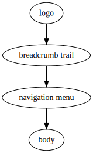

# Ruth Cookbook

See the [README](README.md) for installation and usage. The rest of this
document shows examples of its use.

## Generating a web site <a name="website-example"></a>

Suppose a web site has the following page design:



Most of the elements are the same on each page, but the breadcrumb trail has
to show the canonical path to each page, and the logo is bigger on the home
page, `index/index.xhtml`.

Suppose further that the web site has the following structure, where each
line corresponds to a page:

```
 ├── Home page
$paste{sh,-c,build-aux/dirtree test/cookbook-example-website-expected | sed -e 's/\.xhtml//g' | grep -v index | grep -v \\.}
```

The basic page template looks like this:

```
$paste{cat,test/cookbook-example-website-src/template.in.xhtml}
```

Making the menu an included file is not strictly necessary, but makes the
template easier to read. The generated site will contain the following
files:

```
$paste{build-aux/dirtree,test/cookbook-example-website-expected}
```

The corresponding source files are laid out as follows. This may look a
little confusing at first, but note the similarity to the HTML pages, and
hold on for the explanation!

```
$paste{build-aux/dirtree,test/cookbook-example-website-src}
```

Note that there is only one menu fragment (the main menu is the same for
every page), but each page has its own content (`main.in.xhtml`).

Now consider how Ruth builds the page whose URL is
`Places/Vladivostok/index/index.xhtml`. Assume the source files are in the
directory `source`. This page is built from
`source/Places/Vladivostok/index/index.ruth2.xhtml`, whose contents is
`$paste{cat,test/cookbook-example-website-src/Places/Vladivostok/index/index.ruth2.xhtml}`.

The custom function `ruth:include("foo")` copies the contents of the
“nearest” file with basename “foo” to the file from which the function is
called.

For the site’s index page, the file `index/logo.in.xhtml` will be used for the
logo fragment, which can refer to the larger graphic desired.

The breadcrumb trail is produced by the custom function
`cookbook:breadcrumb()`, defined in
`test/cookbook-example-website-src/funcs.in.xq`, with some help from CSS.

### Building the site

The site is built by running Ruth on the source directory:

```
ruth test/cookbook-example-website-src site
```

## Adding a datestamp using a program <a name="date-example"></a>

Put the the following script that wraps the `date` command in a file called
`date-yyyymmdd.in`:

```
$paste{cat,test/executable-src/date-yyyymmdd.in}
```

Then a datestamp can be added to a templated file by calling the
corresponding custom function:

```
$paste{sh,-c,sed -e 's|\,--date=2016/10/12||' < test/executable-src/Page.ruth.xml}
```

This gives the result:

```
$include{cat,test/executable-expected/Page.xml}
```

## Templating data

Ruth can also be used to template data values. Consider the following “database”:

```
 ├── Home page
$paste{sh,-c,build-aux/dirtree test/data-templating-expected | sed -e 's/\.xhtml//g' | grep -v index | grep -v \\.}
```

The following files will be generated:

```
$paste{build-aux/dirtree,test/data-templating-expected}
```

For each time at each place, there is a data file `data.xml` (or
`zdata.xml`; the `z` prefix just tests that the relative order of names
doesn’t matter) and a web page `index.xhtml`.

The source files are laid out as follows:

```
$paste{build-aux/dirtree,test/data-templating-src}
```

The top-level file `default.in.xml` gives the default animal and bird for a
given time and place:

```
$paste{cat,test/data-templating-src/default.in.xml}
```

### Copying data using `ruth:data`

The various `data.ruth.xml` files each contain an `animal` element and a
`bird` element. Each either contains a literal value, or fetches the data
from the level above, with an XQuery expression embedded in braces, such as:

```
{ruth:data('bird')}
```

This uses the built-in `ruth:data` function to interpolate the contents of
the nearest `bird` element that occurs in the child of an ancestor of the
current file’s parent. This means that it cannot match the file itself, so
it doesn’t get into a loop.

### Querying with `ruth:query` and multi-phase templating

We also want to produce a web page corresponding to each place and time. We
need to query the data for this. We can't conveniently use `ruth:data`, as
that will not fetch data elements at the same level in the hierarchy, and
each web page `index.ruth2.xhtml` is at the same level as the corresponding
`data.xml`. Instead, we use the similar function `ruth:query`, which is just
like `ruth:data`, but starts at the same level as the file being expanded,
rather than at its parent. But that should cause a loop!

To avoid looping, we expand the web page templates after the data templates.
Remember, Ruth updates its internal XML document as it goes, so after all
the data templates have been expanded, they will contain only literal
values. The `2` in the file name `index.ruth2.xhtml` indicates that the file
will be processed in phase 2 (files without a number are processed in phase
0).

The contents of a typical `index.ruth2.xhtml` file is:

```
$paste{cat,test/data-templating-src/place_1/time_1/index.ruth2.xhtml}
```

The calls to `ruth:query` paste the values of the `animal` and `bird`
elements “nearest” to the file; in our case, those in the same directory.

For `place_1/time_1`, the result is:

```
$paste{sh,-c,build-aux/format-xml.js < test/data-templating-expected/place_1/time_1/index.xhtml}
```

## Using XQuery updates

As mentioned in [README.md](README.md), XQuery updates are applied to the
XML document. Therefore, to have any direct effect on the output, the update
expression must be in a different file from the node that it updates, and
must take effect before the file it updates is copies.

The trivial test in `test/updating-xquery-src` shows how this is arranged:
the updating expression in `update.in.ruth.xml` will be processed in phase
0, and the file will not be copied to the output (because of the `.in`
suffix). The update applies to the `<div>` element in `main.ruth2.xml`. The
file is not expanded until phase 2, by which time the update has already
been applied, and the desired change is therefore copied to the output. Note
that `main.ruth2.xml` does not contain any XQuery expressions itself: the
`.ruth2` suffix is used solely to delay its processing until after the
update has taken place.
